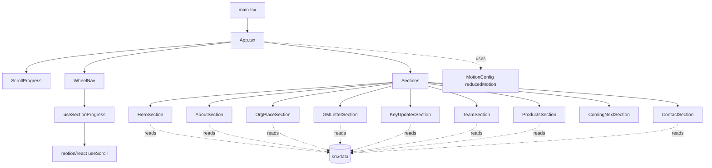

# web

The Vite + React app that powers the GDTD newsletter. See `../README.md` for project context, install, and deploy.

## Scripts

| Command | What it does |
|---|---|
| `bun run dev` | Vite dev server with HMR at `localhost:5173` |
| `bun run build` | Type check and production build to `dist/` |
| `bun run preview` | Serve the built `dist/` on the network |
| `bun run lint` | Biome check (no auto-fix) |
| `bun run check` | Biome check with auto-fix |
| `bun run format` | Biome format only |

## Architecture



## Source layout

```
src/
    main.tsx           ← entry point
    App.tsx            ← section composition
    components/
        common/        ← SectionShell, SectionEyebrow, Watermark, Marquee
        effects/       ← Reveal, Parallax, NumberCounter
        nav/           ← WheelNav + ScrollProgress
        sections/      ← the 9 newsletter sections
        team/          ← person / team card building blocks
    data/              ← team, products, stats, gm, sections, keyUpdates
    hooks/             ← useSectionProgress (wheel sync)
    lib/               ← cn, motion variants, scroll utility
    styles/            ← globals.css (Tailwind v4 @theme tokens)
    types/             ← shared type definitions
```

Data lives in `.ts` files (not JSON) for type safety and autocomplete. Adding a new section means: creating a file in `components/sections/`, adding an entry to `data/sections.ts`, and mounting it in `App.tsx`. The wheel nav picks it up automatically.
